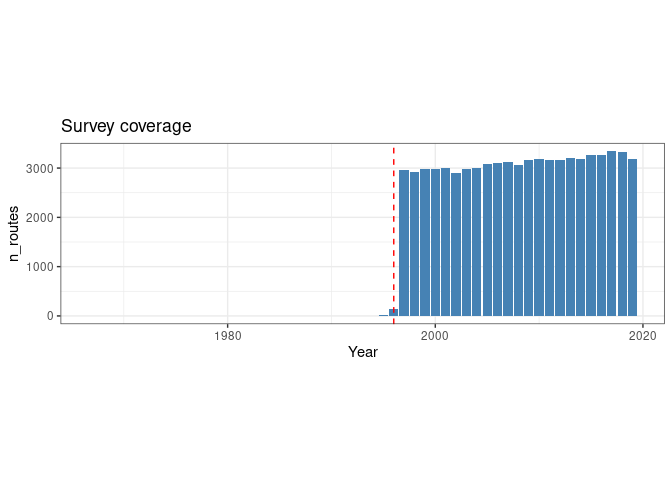

## Introduction

The BBS is a cooperative effort to monitor the status and trends of
North American bird populations. Following a rigorous protocol, BBS data
are collected by thousands of dedicated participants along thousands of
randomly established roadside routes throughout the continent.
Professional BBS coordinators and data managers work closely with
researchers and statisticians to compile and deliver these population
data and population trend analyses on more than 400 bird species, for
use by conservation managers, scientists, and the general public.
([BBS](https://www.pwrc.usgs.gov/bbs/))

BBS data can downloaded in R by using the
[bbsAssistant](https://github.com/trashbirdecology/bbsAssistant) package
which provides routines for the downloading and handling of the complete
dataset.

## What do we need

In order to use BBS data as a case study application for the application
of ASCA to the analysis of large scale count data, a subset of the full
dataset will be organized as a 2 factor investigation considering space
and time as variables.

-   Each route will be considered an observation unit
-   We will focus on routes which have been subject to the monitoring
    from 1997
-   We will restrict our analysis to the 200 most abundant bird species
-   The time interval will be aggregated in a set of five non
    overlapping bins
-   Each one of the routes will be assigned to one of the Level I [North
    American
    Ecoregions](https://www.epa.gov/eco-research/ecoregions-north-america).

## Doing the Job

``` r
## libraries for data handling and preparation
library(bbsAssistant)
library(tidyverse)
library(sf)
```

We start grabbing the latest version of the dataset

``` r
## This is grabbing the data, is getting them another time only if they are new
bbs <- grab_bbs_data()
```

    ## Argument `sb_id` not specified. Using the ScienceBase identifier (sb_id) associated with the 2020 version of the BBS dataset:

    ## bbs_dir not specified. bbs dataset will be saved to  data-in/5ea04e9a82cefae35a129d65 
    ## Attempting to decompress and import files from data-in/5ea04e9a82cefae35a129d65

    ## Rows: 758 Columns: 9

    ## ── Column specification ────────────────────────────────────────────────────────────────────────────────────────────────────────────────────────────────────────
    ## 
    ## chr (9): X1, X2, X3, X4, X5, X6, X7, X8, X9
    ## 
    ## ℹ Use `spec()` to retrieve the full column specification for this data.
    ## ℹ Specify the column types or set `show_col_types = FALSE` to quiet this message.
    ## Joining, by = c("Seq", "AOU", "English_Common_Name", "Spanish_Common_Name", "ORDER", "Family", "Genus", "Species")

The bbs object is a large list which contains almost everything, in
particular:

-   *observations*: contains the observations on the 50 stops along the
    routes (identified by RTENO), with additional fields containing
    additional properties( eg. country, state, and bird species AOU)
-   *routes*: the description of the all sampling points
-   *species_list*: the association of the species AOU with the bird
    species characteristics
-   *weather*: description of the weather conditions @ each stop
-   *vehicle*: observers also count the number of vehicles which were
    passing at each stop during counting

For what we want to do we would like to know which routes (identified by
an unique RTENO) has been regularly patrolled over the years

``` r
## calculate the number of routes patrolled for each year
 year_route <- bbs$observations %>% 
   select(Year,RTENO) %>% 
   group_by(Year) %>% 
   nest() %>% 
   mutate(data = map(data, ~ unique(.x$RTENO))) %>% 
   mutate(n_routes = map_int(data,length)) %>% 
   arrange(Year)
```

Let’s plot the number of routes

``` r
year_route %>% 
  ggplot() +
  geom_col(aes(x = Year, y = n_routes), fill = "steelblue") + 
  geom_vline(xintercept = 1996, lty = 2, col = "red") +
  theme_bw() +
  theme(aspect.ratio = 0.3) + 
  ggtitle("Survey coverage")
```

<!-- -->

The vertical line shows the 1996 limit. So a large scale regular
patrolling started in 1997. We now restrict our analysis to the routes
which have been consistently patrolled from 1997 onwards.

``` r
## filter the time
year_route <- year_route %>% 
   filter(Year > 1996)
 
## on these years the slot of common sites of observation is
common_routes <- Reduce(intersect, year_route$data)

## print the number of routes
length(common_routes)
```

    ## [1] 604

This is the number of routes which have been the subject of regular
control over the years

Now we calculate the cumulative number of observations per species and
per year of the different species across the 50 different stops. We also
restrict to the routes listed in the `common_routes` vector

``` r
## observations
x <- bbs$observations %>% 
   filter(Year > 1996) %>%
   filter(RTENO %in% common_routes) %>% 
   mutate(n = rowSums(across(starts_with("Stop")))) %>% 
   select(!starts_with("Stop"))

## subset of the routes
routes_table <- bbs$routes %>% 
   filter(RTENO %in% common_routes)
```

this is the content of the dataset:

``` r
head(x)
```

    ## # A tibble: 6 × 9
    ##   RouteDataID CountryNum StateNum Route  RPID  Year   AOU RTENO        n
    ##         <int>      <int>    <int> <chr> <int> <int> <int> <chr>    <dbl>
    ## 1     6227835        124        4 002     101  1997    40 12404002     3
    ## 2     6227835        124        4 002     101  1997   530 12404002     5
    ## 3     6227835        124        4 002     101  1997   540 12404002   248
    ## 4     6227835        124        4 002     101  1997  1250 12404002     1
    ## 5     6227835        124        4 002     101  1997  1320 12404002    30
    ## 6     6227835        124        4 002     101  1997  1350 12404002     8

-   *Coutry* and *State* num are self explanatory
-   *RTENO* is the route id
-   *n* is the number of observations

``` r
head(routes_table)
```

    ## # A tibble: 6 × 12
    ##   CountryNum StateNum Route Route…¹ Active Latit…² Longi…³ Stratum   BCR Route…⁴
    ##        <int>    <int> <chr> <chr>    <dbl>   <dbl>   <dbl>   <dbl> <dbl>   <dbl>
    ## 1        840        2 001   ST FLO…      1    34.9   -87.6      14    27       1
    ## 2        840        2 010   MILLER…      1    33.2   -85.9      11    29       1
    ## 3        840        2 014   SMYER …      1    33.5   -86.6      13    28       1
    ## 4        840        2 022   HARRELL      1    32.4   -87.2       4    27       1
    ## 5        840        2 029   COTTON…      1    32.1   -85.1       4    27       1
    ## 6        840        2 043   BLOCTON      1    33.1   -87.1      13    27       1
    ## # … with 2 more variables: RouteTypeDetailID <dbl>, RTENO <chr>, and
    ## #   abbreviated variable names ¹​RouteName, ²​Latitude, ³​Longitude, ⁴​RouteTypeID
    ## # ℹ Use `colnames()` to see all variable names

This tibble, instead, holds the information about the different routes

The `sf` package can now be used to link the routes with the Ecoregions

``` r
## read the shape file of the ecoregions
ecoregions <- read_sf("na_cec_eco_l1/NA_CEC_Eco_Level1.shp")

## assign the crs and validate the object
ecoregions <- st_transform(ecoregions ,crs=4326) %>% 
  st_make_valid()

## create a spatial object with the routes
routes_sf <- st_as_sf(routes_table, coords = c('Longitude', 'Latitude'), crs = st_crs(ecoregions))

## assign routes to ecoregions
routes_sf<- routes_sf %>% mutate(
   intersection = as.integer(st_intersects(geometry, ecoregions)),
   area = if_else(is.na(intersection), '', ecoregions$NA_L1NAME[intersection])
 ) 
```

To focus on large scale trends, we will restrict ourself only to
ecoregions which contains more than ten observation routes

``` r
## identify the ecoregions which are well represented
area_id_in <-  routes_sf %>% 
  count(area) %>% 
  filter(n > 10) %>% 
  pull(area)

## keep only the right routes
routes_sf <- routes_sf %>% 
  filter(area %in% area_id_in)
```

The last step of the data preparation is restricting to the most
observed 200 bird species

``` r
species_in <- x %>% 
  filter(RTENO %in% routes_sf$RTENO) %>% 
  count(AOU) %>% 
  arrange(desc(n)) %>% 
  slice(1:200) %>% ## keep only the 200 most abundant species
  pull(AOU)
```

And finally we create the observation table

``` r
## To get to the final dataset we also construct 5 consecutive year groups  
 x1 <- x %>%
   filter(RTENO %in% routes_sf$RTENO) %>% 
   filter(AOU %in% species_in) %>% 
   left_join(routes_sf %>% select(RTENO,area)) %>% 
   mutate(period =  cut(Year, breaks = 5)) %>% 
   group_by(area,period,AOU,RTENO) %>% 
   summarise(n = sum(n)) %>% 
   ungroup() %>% 
   pivot_wider(names_from = AOU, values_from = n, values_fill = 0)
```

    ## Joining, by = "RTENO"
    ## `summarise()` has grouped output by 'area', 'period', 'AOU'. You can override using the `.groups` argument.

``` r
 ## To proceed with the analysis we want also the table with the species
 species_table <- bbs$species_list %>% 
   filter(AOU %in% species_in)
```

## Aknowledgments

The authors would like to thank thousands of U.S. and Canadian
participants who annually perform and coordinate the survey.
