## Introduction

This demo illustrate the results of the ASCA analysis of the BBS
dataset. The data preparation is discussed in detail in a specific
vignette.

``` r
library(tidyverse)
library(gASCA)
```

    ## Loading required package: parallel

``` r
library(sf)
```

## Data decomposition

``` r
## load the dataset
load("BBS_data.RData")

## create the design data frame
d <- x1 %>% 
  select(area,period)

## create the data frame with the counts
x <- x1 %>% 
  select(-c("area","period","RTENO"))
```

Just to have an idea of the size of the dataset let’s look to the size
of x:

``` r
dim(x)
```

    ## [1] 2875  200

So basically we are dealing with 200 species observed across almost 600
routes. A table of the `d` data.frame gives a better representation of
the dataset:

``` r
## tabular view of the design data frame 
table(d)
```

    ##                                  period
    ## area                              (1997,2001] (2001,2006] (2006,2010]
    ##   EASTERN TEMPERATE FORESTS               293         293         293
    ##   GREAT PLAINS                             81          81          81
    ##   MARINE WEST COAST FOREST                 16          16          16
    ##   NORTH AMERICAN DESERTS                   58          58          58
    ##   NORTHERN FORESTS                         71          71          71
    ##   NORTHWESTERN FORESTED MOUNTAINS          56          56          56
    ##                                  period
    ## area                              (2010,2015] (2015,2019]
    ##   EASTERN TEMPERATE FORESTS               293         293
    ##   GREAT PLAINS                             81          81
    ##   MARINE WEST COAST FOREST                 16          16
    ##   NORTH AMERICAN DESERTS                   58          58
    ##   NORTHERN FORESTS                         71          71
    ##   NORTHWESTERN FORESTED MOUNTAINS          56          56

Here we run the decomposition:

``` r
dec <- ASCA_decompose(d = d, x = x, 
                      f = "area + period + area:period",
                      glm_par = list(family = poisson()))
```

The permutation test takes a rather long time (20 minuts on a standard
laptop) and it is not included in this demo, anyway only one species out
of the 200 included in the analysis was showing a non significant
pseudo-*R*<sup>2</sup>. For this reason we will keep the full dataset in
the following analysis.

Let’s now make a plot of the 6 ecoregions represented in the dataset

``` r
## load the ecoregions
ecoregions <- read_sf("na_cec_eco_l1/NA_CEC_Eco_Level1.shp")
ecoregions  <- st_transform(ecoregions ,crs=4326) %>% 
   st_make_valid() %>% 
   filter(NA_L1NAME %in% unique(d$area))
```

And now we make the plot

``` r
ecoregions %>% 
  rename("region" = "NA_L1NAME") %>% 
  ggplot() + 
  geom_sf(aes(fill = region), col= "gray30", lwd = 0.1, alpha = 0.7) + 
  scale_fill_brewer(palette = "Set1", name = "") + 
  theme_bw() + 
  theme(legend.position = "bottom")
```

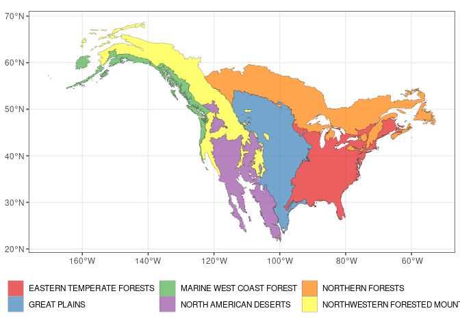<!-- -->

Now we run the svd the three model terms:

``` r
LVs <- ASCA_svd(dec$decomposition)
```

As a first general comment let’s consider the norm of the decomposition
terms

``` r
barplot(dec$terms_L2, col = "steelblue")
```

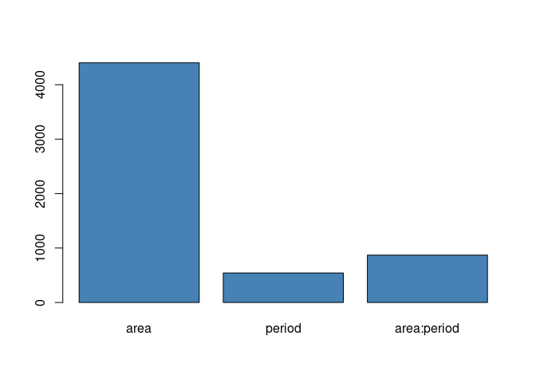<!-- -->

The geographic dimension turns out to be by far the most influential
factor. What happens with time is interesting: the time effect is indeed
more relevant when is combined with the area. This indicate that
continental scale trends are expected to be less relevant than
population dynamics happening at level of the individual ecoregions.

## Effect of the Ecoregion

Let’s now focus on the Ecoregion factor. It’s scree plot is shown below

``` r
tibble(sdev = LVs$area$sdev) %>% 
  slice(1:5) %>% 
  ggplot() + 
  geom_col(aes(x = 1:5, y = sdev), fill = "steelblue") + 
  ggtitle("Design Factor: area") + 
  xlab("LVs") + 
  theme_bw()
```

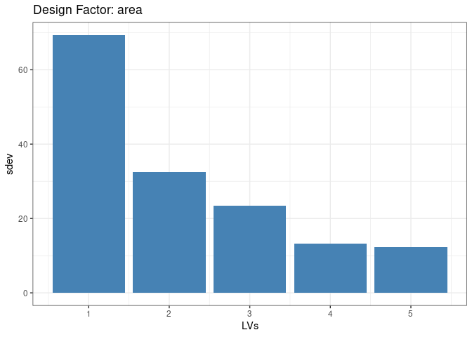<!-- -->

The previous plot clearly shows that one latent factor is able to
capture a large part of the variance. Its associated latent trend can be
visualized as a map:

``` r
tibble(region = x1$area,
       eig_area = round(LVs$area$x[,1],2)) %>% 
  unique() %>% 
  right_join(ecoregions, by = c("region" = "NA_L1NAME")) %>% 
  st_as_sf() %>%
  ggplot() + 
  geom_sf(aes(fill = eig_area), col= "gray30", lwd = 0.1, alpha = 0.7) + 
  scale_fill_gradient2(low = "blue", mid = "white", high = "orange", midpoint = 0, name = "score") + 
  ggtitle("LV1 Scoreplot") + 
  theme_bw() 
```

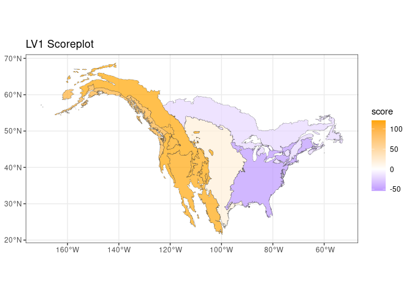<!-- -->

The presence of a clear east-west trend is clear, interestingly the
three western ecological regions show a comparable importance in this
latent trend The loadings of this latent factor can be used to
investigate which species are mainly contributing to this trend:

``` r
LVs$area$rotation[,1] %>% 
  as_tibble(rownames = "AOU") %>% 
  arrange(value) %>% 
  mutate(pos = seq_along(value)) %>% 
  ggplot() + 
  geom_point(aes(x = pos,y = value), col = "steelblue", alpha = 0.5, size = 3) + 
  geom_hline(yintercept = 0, col = "red", lty = 2) + 
  xlab("Species index") + 
  ylab("LV1 Loadings") + 
  theme_bw() +
  theme(aspect.ratio = 0.4)
```

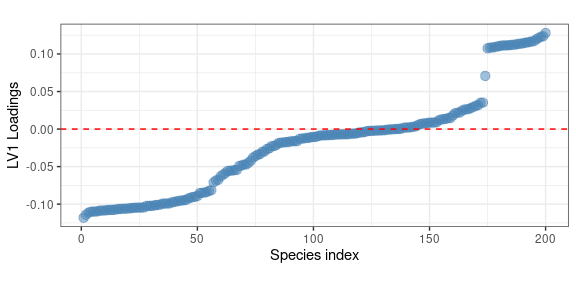<!-- -->

Interestingly, the previous plot highlights the presence of a well
identified group of species (a sort of *metapopulation*) which are
consistently showing large positive loadings. In terms of spatial
distribution this is associate to a larger abundance in the western US
regions. Hereafter we show a map showing the abundance of the species
showing the larger positive loadings:

``` r
## identify the specie showing the larger loadings
top_LV1 <- names(sort(LVs$area$rotation[,1], decreasing = TRUE)[1])

## plot its distribution over a map
x1 %>% 
  select(area, all_of(top_LV1)) %>% 
  group_by(area) %>% 
  summarize(across(all_of(top_LV1),~ sum(.x))) %>% 
  right_join(ecoregions, by = c("area" = "NA_L1NAME")) %>% 
  st_as_sf() %>% 
  ggplot() + 
  geom_sf(aes(fill = log10(`4130`+1)), col= "gray30", lwd = 0.1, alpha = 0.7) + 
  scale_fill_gradient2(low = "white", high = "orange", name = "Abundance (log)") + 
  ggtitle(species_table %>% filter(AOU == "4130") %>% pull(English_Common_Name)) +
  theme_bw() 
```

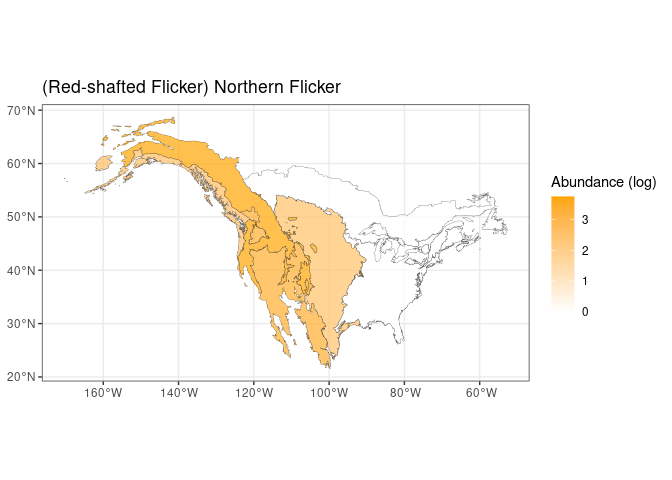<!-- -->

The expected trend is fully confirmed by the previous plot. An opposite
trend is expected for the species showing large negative loadings.
Interestingly no clustering in the loadings seems to be present there.

## Effect of the period

If we consider the effect of the *period* alone and, another time, we
plot the first eigentrend

``` r
tibble(period = x1$period,
       eig_trend = round(LVs$period$x[,1],2)) %>% 
  unique() %>% 
  ggplot() + 
  geom_point(aes(x = period, y = eig_trend), col = "steelblue", size = 4, alpha = 0.7) + 
  geom_line(aes(x = period, y = eig_trend, group = 1), col = "steelblue") + 
  ylab("Score LV1") + 
  theme_bw() + 
  theme(aspect.ratio = 0.5)
```

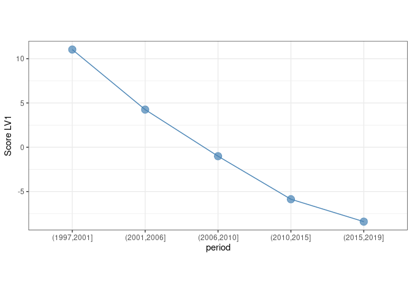<!-- -->

We identify a clear decreasing pattern along the 5 year bins. As before,
the loadings of this eigentrend can be used to identify the species
which are mostly contributing to this trend

``` r
LVs$period$rotation[,1] %>% 
  as_tibble(rownames = "AOU") %>% 
  arrange(value) %>% 
  mutate(pos = seq_along(value)) %>% 
  ggplot() + 
  geom_point(aes(x = pos,y = value), col = "steelblue", alpha = 0.5, size = 3) + 
  geom_hline(yintercept = 0, col = "red", lty = 2) + 
  xlab("Species index") + 
  ylab("LV1 Loadings") + 
  theme_bw() + 
  theme(aspect.ratio = 0.4)
```

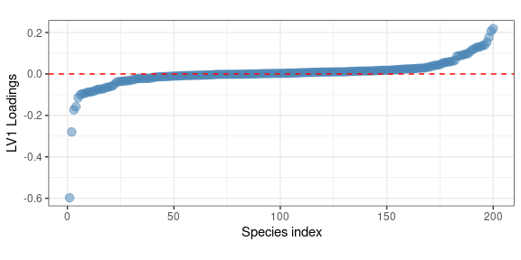<!-- -->

Here the larger (negative) contributor is:

``` r
## identify the species showing the larger loadings
top_LV1_period<- names(sort(LVs$period$rotation[,1])[1])

species_table %>% filter(AOU == top_LV1_period) %>% pull(English_Common_Name)
```

    ## [1] "Eurasian Collared-Dove"

and its measured trend is the following

``` r
x1 %>% 
  ggplot() + 
  geom_point(aes(x = period, y = `22860`), position = position_jitter(width = 0.1), 
             size = 2, col = "steelblue", alpha = 0.8, pch = 1) + 
  scale_y_log10() + 
  ggtitle(species_table %>% filter(AOU == top_LV1_period) %>% pull(English_Common_Name)) + 
  ylab("Abundance") + 
  xlab("") + 
  theme_bw()
```

    ## Warning: Transformation introduced infinite values in continuous y-axis

    ## Warning: Removed 2183 rows containing missing values (geom_point).

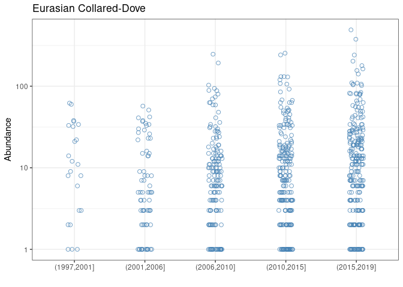<!-- -->

speaking of a strong average increase in the observation period. This is
exactly what was observed for the Eurasian Collared-Dove, which is
native to Asia, and has invaded North America from the late 1970s. After
the first observations in Florida, the species has increased in
abundance and spread rapidly across the continent.

## Effect of the interaction

Let’s finally consider the first LV of the interaction term. In terms of
variable importance

``` r
LVs$`area:period`$rotation[,1] %>% 
  as_tibble(rownames = "AOU") %>% 
  arrange(value) %>% 
  mutate(pos = seq_along(value)) %>% 
  ggplot() + 
  geom_point(aes(x = pos,y = value), col = "steelblue", alpha = 0.5, size = 3) + 
  geom_hline(yintercept = 0, col = "red", lty = 2) + 
  xlab("Species index") + 
  ylab("LV1 Loadings") + 
  theme_bw() +
  theme(aspect.ratio = 0.4)
```

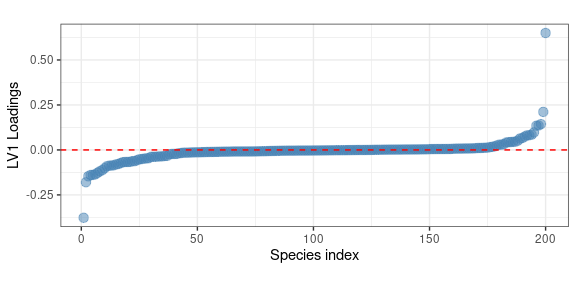<!-- -->

In this case we observe two specific species showing large positive and
negative loadings

``` r
## extract the specied
species_table %>% 
  filter(AOU %in% names(sort(abs(LVs$`area:period`$rotation[,1]), decreasing = TRUE)[1:2])) %>% 
  pull(English_Common_Name)
```

    ## [1] "Eurasian Collared-Dove" "Swainson's Hawk"

Interestingly one of them is another time the Eurasian Collared-Dove.
This means that this species not only was showing a large contribution
on the *period* factor - i.e. a large variation in time - but also an
important dependence of that variation on the ecoregion. This trend is
clearly shown in the following plot

``` r
x1 %>% 
  select(area, period, `22860`) %>% 
  group_by(area,period) %>% 
  summarize(I = sum(`22860`)) %>% 
  right_join(ecoregions, by = c("area" = "NA_L1NAME")) %>% 
  st_as_sf() %>% 
  ggplot() + 
  geom_sf(aes(fill = log10(I+1)), col= "gray30", lwd = 0.1) + 
  facet_wrap(~ period, nrow = 1) + 
  scale_fill_gradient2(low = "white", mid = "orange", high = "red", midpoint = 2, name = "Abundance (log)") + 
  ggtitle(species_table %>% filter(AOU == "22860") %>% pull(English_Common_Name)) +
  theme_bw() + 
  theme(legend.position = "bottom")
```

    ## `summarise()` has grouped output by 'area'. You can override using the `.groups`
    ## argument.

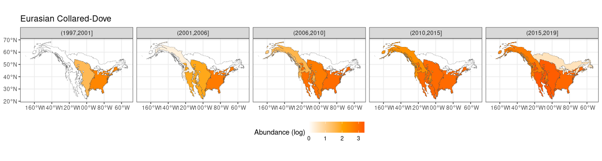<!-- -->

Which clearly highlights its progressive spread over North America
starting from the late nineties.
